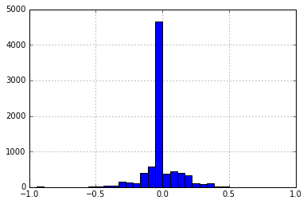
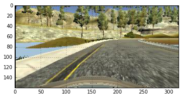
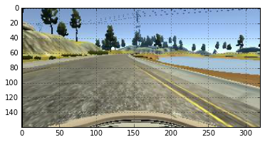
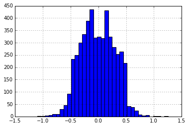

# Behavioural cloning project

## Introduction

The purpose of this project is to train a car in one particular track and then create a model that will make it drive in autonomous mode, in the same track and a different one that has never been trained. 

## Approach to the problem

Being new to the area of CNNs, a valuable source of information apart from the courses, was the forum. 

It became clear to me that the most important part is to acquire enough and information - rich data, in terms that there are several non - zero steering angles and cases such as recovery from the edges of the road. Similarly to the project with the traffic - sign classifier, many images can be artificially generated, but in this case extra care should be taken to adjust the steering angle in the case of shape transformations such as moving on the x- axis.

### Initial approach

The first trial was to use the provided data to train the model and not make any data extension. That approach was giving poor results, even in the first track, as it was only getting through a few turns but then going off road. For the second track, the failure was total as the car couldn't get through even the first turn. Therefore, the second and more reasonable approach was to generate many data from the existing images. Many simulations were ran to acquire values that looked optimal. 

### Dataset Characteristics

The dataset that I used is the one provided by Udacity, I did not acquired more training data from the simulator. The training images are for Track1 and the steering angle histogram of the dataset is shown below.

**Figure 1.** Histogram of steering of the unprocessed training data

Obviously the data is heavily biased towards zero steering angles which is not very helpful for the training. There are very few images though where large steering is observed. Two representative examples are shown in Fig2, for the extreme steering values. Also there is some limited skewness towards steering to the right direction

  

**Figure 2.** Car found at the left edge (*steering = 1*) and at the right edge (*steering ~ -0.95*)
 
The dataset needs to be augmented and carry more information and variety. Therefore, certain geometric transformations that affect the steering, namely random shifting of the x-axis and flipping are applied. Another technique is to artificially consider that the data originate in a random way from the right and left camera therefore a constant is subtracted or added respectively. The transformations are described in the next paragraph. 

### Image Transformations

Several transformations were applied to the images, as explained in the list:

- **Shifting** of the image randomly to the left or to the right: According to the shifting, some value needs to be added accordingly to the steering angle feature. That way, especially the zero steering angle images carry more useful information. The used function is the `cv2.warpAffine` from `cv2` package.

- **Brightness change** of the existing data: The change of the brightness will give the autonomous car the flexibility to drive to darker tracks, such as the untrained one. The used function is the `cv2.cvtColor` from `cv2` package and there is conversion between RGB and HSV domains.

- **Use of right and left cameras** : This is performed artificially. When an image is acquired, it is randomly considered to originate from the right, left or centre camera and the necessary shifting is applied. That way the car can recover better from the edges. The price, at least in my case which I didn't manage to correct is that in straight line the car is moving between the edges which is certainly not desirable. 

- **Flip image**: Because the track has more turns to the left side, the training images are randomly flipped. The steering is negated in that case. The used function is the `cv2.flip` from `cv2` package.

- **Cropping** of the top of the image: The top of the image does not have much useful road information and some small part of it can be cropped and also reduce the image size. Also the bottom part can be trimmed as it has the car in it. 30px were cropped from the top and 25px from the bottom. I experimented cropping left and but no improvement was observed so I left it unchanged. 

- **Final square resizing** : The final image is resized to a value of 64x64 pixels as it will give fewer model parameters. The used function is the `cv2.resize` from `cv2` package. I got this idea for resizing from the forum. I experimented with several values like double the size but didn't see much difference in the performance. 

Another idea in the forum was to add shadow, like having a part of the image darker than the rest but that was something which I didn't try. Also, I did not experiment with blurring the images. 

The application of the transformations is having a significant effect on the distribution of the steering. A representative histogram is obtained as in the figure below. Data look richer in information and will provide a model that is more generic and can drive into different unknown tracks.

**Figure 1.** Histogram of steering of the augmented training data

## Model selection

The selected model is rather simple, described in the following code. The idea was again proposed in the forum and I added an extra Convolutional and Fully Connected Layer. Personally, at the current state of my learning, I don't have the full intuition on how deep a network should be and I believe there are many degrees of freedom. Certainly though, the submitted one is very close to what I would use, mostly determined by the previous projects. I ran dozens of simulations, experimenting by deepening even more the network but the parameters much more numerous and the performance not significantly better than the lighter model. 
This model is therefore the best I could simulate and there is room for improvement. 

    model.add(Convolution2D(16, 5, 5, subsample=(2, 2), border_mode="same", input_shape=( row, col, ch)))
    model.add(BatchNormalization())
    model.add(ELU())
    model.add(Convolution2D(32, 5, 5, subsample=(2, 2), border_mode="same"))
    model.add(BatchNormalization())
    model.add(ELU())
    model.add(Convolution2D(64, 5, 5, subsample=(2, 2), border_mode="same"))
    model.add(Flatten())
    model.add(Dropout(.2))
    model.add(ELU())
    model.add(Dense(512))
    model.add(Dropout(.5))
    model.add(ELU())
    model.add(Dense(128))
    model.add(Dropout(.5))
    model.add(ELU())
    model.add(Dense(1, name= 'Steering_Angle'))

    Total params: 513,313
    Trainable params: 513,121
    Non-trainable params: 192
    
### Fit generator function 

The function for the fit_generator function is shown below. Using pandas, the csv driving.log file is read and then he line containing the image path and the steering information is chosen randomly and the transformations are applied. 

    def train_data_batch(data, batch_size = 64):
    ''' 
    Function for the fit generator
    '''
    batch_images = np.zeros((batch_size, 64, 64, 3))
    batch_steering = np.zeros(batch_size)
    while 1:
    for ii in range(batch_size):
    i_line = np.random.randint(len(data))
    line_data = data.iloc[i_line] 
    x,y = preprocess_image_file_train(line_data)
    
    batch_images[ii] = x
    batch_steering[ii] = y
    yield batch_images, batch_steering

###Training of the model
I used 6 epochs to train the model, as the loss was not improving much more than that. 

    Epoch 1/6
    19200/19200 [==============================] - 253s - loss: 0.3922  
    Epoch 2/6
    19200/19200 [==============================] - 210s - loss: 0.1166 
    Epoch 3/6
    19200/19200 [==============================] - 192s - loss: 0.0642 
    Epoch 4/6
    19200/19200 [==============================] - 187s - loss: 0.0480 
    Epoch 5/6
    19200/19200 [==============================] - 233s - loss: 0.0413 
    Epoch 6/6
    19200/19200 [==============================] - 221s - loss: 0.0371 
    Fitting done
    Model Saved

### Testing

The testing was quite challenging as there were several contradictory requirements between the two tracks. Apart from the many degrees of freedom for the training data and the model selection to model the steering angle, there is also the throttle parameter that can be either kept constant or vary with the steering. My approach all the time was to keep the throttle at 0.2. That was enough for Track1 with the car following a smooth trajectory but for Track2 there were some uphill paths were the car was stalled. I increased the throttle to 0.3, Track2 was successful but in Track1 though success too, the car was following a trajectory more suitable to a roller-coaster. After my first review, I was suggested to use a variable throttle value. Modifying the parameters it is working now and the car operates quite smoothly. In Track2 it is a bit marginal in the uphill as the speed is decreasing but is managing to recover. The expression for the throttle is: `throttle = max(0.15, -0.1/0.05 * abs(steering_angle) + 0.45)`

###Issues
This project has been quite challenging for me, as there was initially some time spent to get familiar with Keras. and some procedures such as the fit_genetaror. Also, it is my first time that I am getting involved with DNNs and I am starting to get some intuition. 

As soon as the simulator was set to work in autonomous mode, I had difficulties to train a successful model as there are many degrees of freedom and many approaches can lead to a solution. As soon as a relatively simple model was chosen, the performance was decent but failures were occurring in both tracks. 

For the first track, the major problem is that the car is driving in an unstable way especially at the straight lines while it behaves better at the turns. That was fixed after the first review applying a variable throttle. 

For the second track, there were some particular corners where the car was under-steering and hitting the side walls. The driving behaviour though looks much smoother mainly because there are more turns and the car is more certain where to turn. Also, I had to increase the throttle as smaller values were causing the car to stop during a particular uphill point towards the end of the track. 

The trade-off between the two tracks is that larger steering is favouring Track2 which has sharper and more turns but makes more unstable the driving at Track1. 

### Conclusion
The highlight of the approach is that it is quite simple and is using the existing data by adding transformation and enriching the information. 

The car also recovers nicely when it reaches the side of the road especially on Track2 where it was failing in a particular turn. Certainly there can be improvements in the driving behaviour but the result was satisfactory and massively accelerated my learning curve. 

